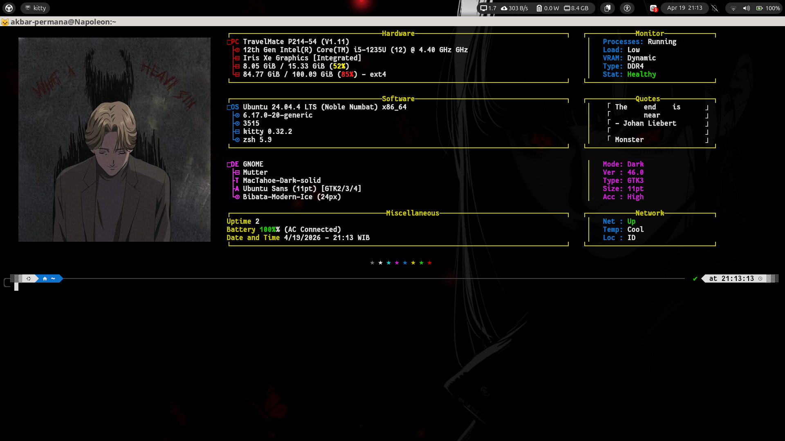

# config-v2.jsonc

> *"Buat apa pake desktop cantik kalau kerjanya tetep nunda-nunda"*  
> *— akbar permana, sambil staring ke monitor yang udah dikonfigurasi 3 jam*

<div align="center">


</div>

---

## Tampilannya



---

## Apa Ini?

Config [fastfetch](https://github.com/fastfetch-cli/fastfetch) yang — jujur — habiskan waktu lebih lama dari seharusnya.

Fitur yang "dibanggakan":
- **Dual-panel layout** — info sistem di kiri, panel kecil di kanan. Supaya terlihat seperti orang yang tahu apa yang mereka lakukan
- **Custom logo** lewat kitty terminal — foto bisa masuk ke terminal. Ya, kamu baca dengan benar
- **Quote section** dari Johan Liebert — karena tidak ada yang lebih pas untuk mendeskripsikan kondisi RAM yang penuh dari *Monster*
- **Warna TokyoNight** — gelap, dramatic, dan sesuai dengan energi orang yang compile kernel jam 2 pagi
- **Tree-style hierarchy** dengan simbol `⊙` dan `⊟` — bukan karena perlu, tapi karena bisa

---

## Prasyarat

Sebelum sok-sokan copy config ini, pastiin dulu:

- **fastfetch** — versi terbaru, bukan yang lama. Kalau config ini tidak jalan, 90% itu karena versi fastfetch kamu ketinggalan zaman
- **kitty terminal** — buat logo gambar bisa muncul. Kalau pakai terminal lain, bagian logo akan jadi tanda tanya besar, secara harfiah
- **Font monospace** yang support Unicode — karena simbol `⊙`, `⊟`, `┌`, `└` ini bukan emoji, ini karakter Unicode yang butuh font yang tidak murahan
- **GNOME + Wayland** — kalau setup kamu beda, modul `de`, `wm`, `wmtheme` mungkin ngeluarin hasil yang aneh. Itu bukan bug config-nya, itu bug hidup kamu

---

## Instalasi

### 1. Install Fastfetch

**Ubuntu/Debian:**
```bash
sudo add-apt-repository ppa:zhangsongcui3371/fastfetch
sudo apt update && sudo apt install fastfetch
```

**Arch (kalau kamu lebih suka susah):**
```bash
sudo pacman -S fastfetch
```

**Nix/NixOS (kamu tahu siapa kamu):**
```bash
nix-env -iA nixpkgs.fastfetch
```

---

### 2. Clone / Copy Config

```bash
# Buat direktori config kalau belum ada
mkdir -p ~/.config/fastfetch

# Copy file config
cp config-v2.jsonc ~/.config/fastfetch/config.jsonc
```

> **Catatan soal nama file:** Fastfetch nyari file bernama `config.jsonc` secara default. Kalau kamu simpan dengan nama lain, nanti komplen sendiri waktu `fastfetch` tidak ngeluarin tampilan yang diharapkan.

---

### 3. Setup Logo (Opsional tapi Penting)

Config ini pakai foto di path `/home/akbar-permana/Pictures/zshpic/johan.png` — jelas, path itu tidak ada di komputer kamu.

Ubah bagian ini di `config.jsonc`:

```jsonc
"logo": {
  "type": "kitty",
  "source": "/home/akbar-permana/Pictures/zshpic/johan.png",  // ← GANTI INI
  "height": 25,
  "width": 47,
  ...
}
```

Ganti dengan path gambar milik kamu:

```jsonc
"source": "/home/NAMAMU/Pictures/foto-kamu.png"
```

**Soal tipe logo:**

| `type` | Artinya | Kapan Pakai |
|--------|---------|-------------|
| `kitty` | Render gambar via kitty protocol | Kalau pakai kitty terminal |
| `iterm` | Render gambar via iTerm2 protocol | Kalau pakai iTerm2 / WezTerm |
| `sixel` | Format sixel | Terminal yang support sixel |
| `auto` | Fastfetch pilih sendiri | Males mikir |
| `none` | Tidak ada logo | Minimalis atau terminal kamu tidak support |

Kalau tidak mau repot, ganti `type` jadi `"none"` dan hapus bagian `source`. Tampilan tetap berjalan normal, minus foto aesthetic-nya.

---

### 4. Sesuaikan Quotes

Bagian quotes di panel kanan ada di sini — hardcoded sebagai `custom` module:

```jsonc
{
  "type": "os",
  "key": "{#34}□OS",
  "format": "{pretty-name} {arch}               {#33}                             │   {#37}「 The    end    is      」"
},
```

Teks setelah `│` itu quotes-nya. Ganti dengan apapun yang kamu mau — kutipan filsuf, lirik lagu favorit, atau keluhan hidup. Pastikan panjang karakternya kira-kira sama supaya alignment panel kanannya tidak berantakan.

Kalau tidak mau alignment manual, hapus saja modul `custom` yang jadi separator panel kanan, dan quotes-nya dijadikan modul terpisah di bawah.

---

### 5. Jalankan

```bash
fastfetch
```

Kalau tampilannya berantakan, kemungkinan besar:

1. **Font tidak support Unicode** → ganti font terminal
2. **Kitty tidak terdeteksi** → ganti `type: "kitty"` jadi `type: "none"`  
3. **Versi fastfetch terlalu lama** → update
4. **Path gambar salah** → baca lagi langkah 3, pelan-pelan

---

## Kustomisasi Lanjutan

### Ganti Warna

Kode warna di config ini pakai format `{#XX}` di mana XX adalah kode ANSI:

| Kode | Warna |
|------|-------|
| `{#31}` | Merah |
| `{#32}` | Hijau |
| `{#33}` | Kuning |
| `{#34}` | Biru |
| `{#35}` | Magenta/Purple |
| `{#37}` | Putih/Default |
| `{#95}` | Magenta terang |

Ganti angkanya sesuai selera. Tidak ada yang akan menghakimi kamu. Kecuali kalau kamu pilih semua warna kuning — itu harus dihentikan.

### Tambah/Hapus Modul

Semua modul yang tersedia ada di [dokumentasi fastfetch](https://github.com/fastfetch-cli/fastfetch/wiki/Configuration). Yang sering berguna:

```jsonc
{ "type": "localip" },        // IP lokal
{ "type": "publicip" },       // IP publik (butuh internet)  
{ "type": "weather" },        // Cuaca (butuh internet + config)
{ "type": "player" },         // Musik yang lagi main
{ "type": "bluetooth" },      // Device bluetooth
```

### Alignment Panel Kanan

Panel kanan dibuat dengan spasi di dalam format string — bukan fitur bawaan fastfetch, ini trik paling tidak elegant yang ada. Kalau resolusi terminal kamu beda, alignment-nya akan geser.

Untuk menyesuaikan: hitung manual berapa spasi yang dibutuhkan sampai `│` ada di kolom yang benar. Ya, manual. Tidak ada cara yang lebih baik, dan ini adalah dosa asli dari config ini.

---

## Troubleshooting

| Masalah | Penyebab | Solusi |
|---------|----------|--------|
| Simbol `⊙` tidak muncul / jadi kotak | Font tidak support karakter ini | Install Nerd Font atau font monospace yang lengkap |
| Logo tidak muncul | Bukan di kitty, atau path salah | Ganti `type` jadi `none` atau perbaiki path |
| Panel kanan misaligned | Resolusi terminal beda | Sesuaikan jumlah spasi secara manual, sambil istighfar |
| Module tidak ada datanya | Modul tidak support di sistem kamu | Hapus modul itu dari config |
| `fastfetch: command not found` | Belum install | Install dulu. Baca lagi dari atas. |
| Semua jalan tapi tidak sebagus preview | Terminal font kamu beda | Pakai font yang sama: JetBrains Mono atau Cascadia Code |

---

## File

| File | Isi |
|------|-----|
| `config-v2.jsonc` | Config utama. Satu-satunya file yang penting. |
| `README.md` | Yang lagi kamu baca ini. |

---

## Dependencies

| Tool | Fungsi |
|------|--------|
| [fastfetch](https://github.com/fastfetch-cli/fastfetch) | Engine utama |
| [kitty](https://sw.kovidgoyal.net/kitty/) | Terminal buat render gambar |
| JetBrains Mono / Cascadia Code | Font supaya semua simbol muncul dengan benar |

---

### ⚠️ Disclaimer

Config ini dibuat untuk setup spesifik (Ubuntu + GNOME + Wayland + kitty). Kalau kamu pakai setup berbeda, ada bagian yang perlu disesuaikan. Developer tidak bertanggung jawab atas:

- Waktu yang hilang karena debugging alignment panel kanan
- Keputusan untuk install Arch setelah lihat config ini
- Produktivitas yang menurun karena terlalu sering buka terminal buat lihat fastfetch

<div align="center">

Made with terlalu banyak kopi dan terlalu sedikit tidur oleh [akbar-permana](https://github.com/akbar-permana)

Kalau config ini membantu, kasih ⭐ — buat portofolio, hehe. Moga masuk surga, aamiin.

</div>